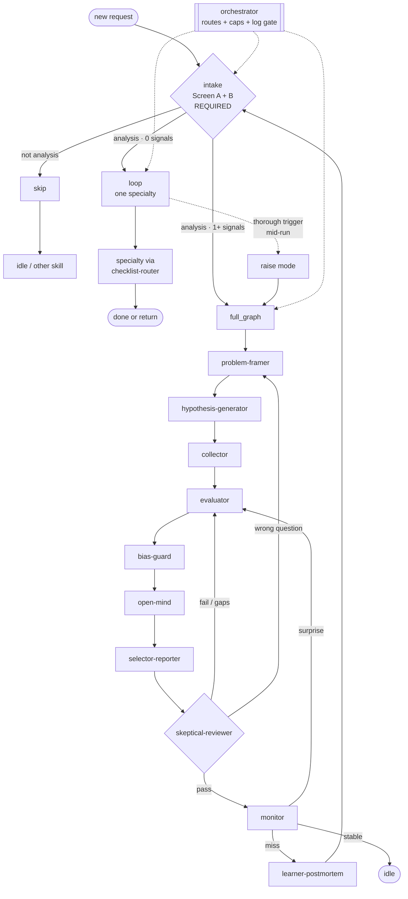
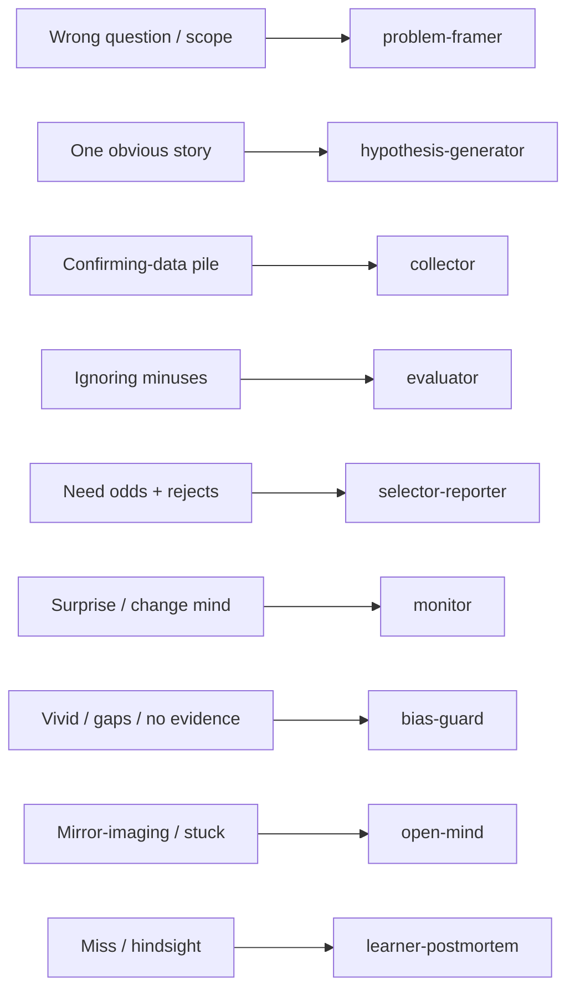

# redglass

Agent skill for hard judgment under incomplete data.

This skill is **agent-agnostic**. Any agent that can read `SKILL.md` can use it.
Hermes is one optional host. It is not the product.

The method comes from Richards J. Heuer, Jr., *Psychology of Intelligence Analysis* (CSI/CIA, 1999).
This repo does **not** ship the book text.

## Modes at a glance

Every request starts at **intake**. Intake picks one mode:

| Mode | Meaning |
|---|---|
| `skip` | Not analysis. Stop this skill. |
| `loop` | One specialty agent (or a short checklist pass). |
| `full_graph` | Full ACH path with log, matrix, and skeptical-reviewer. |

A **loop** can raise to **full_graph** mid-run when a thorough-investigation trigger fires.
See [references/thorough-investigation.md](references/thorough-investigation.md).

Which **model class** to use per agent (thinker vs mid vs agentic vs gate): [guides/model-fit.md](guides/model-fit.md).

## How the modes connect

**Intake is always first.** Do not open a specialty agent until intake sets `mode`.



### Read the diagram

1. **Intake** is step 0 and **required**. It answers: is this analysis? then loop or full graph?
2. **Orchestrator** does not replace intake. It runs intake first, then routes, caps, and log gates.
3. **skip** leaves this skill. Use a debugger, implement, or explain skill instead.
4. **loop** loads one agent from the checklist router. It stops when that job is done.
5. **full_graph** walks the specialty chain. Shared state is `analysis_state`.
6. **skeptical-reviewer** can send work back to `evaluator` or `problem-framer`.
7. **monitor** watches milestones. Surprise re-enters `evaluator`. A miss goes to `learner-postmortem`, then back through intake if a new judgment starts.
8. Dashed edge from loop: a loop can **raise** to full_graph when cost, competing stories, or deception appears.

Canonical sources (edit these, not only the README copy):

- [diagrams/modes-and-loops.mmd](diagrams/modes-and-loops.mmd) — this overview
- [diagrams/analysis-agent-graph.mmd](diagrams/analysis-agent-graph.mmd) — full graph edges
- [diagrams/checklist-router.mmd](diagrams/checklist-router.mmd) — loop specialty picker

## Loop specialty picker

In **loop** mode, the checklist trigger picks the agent:



## What you get

| Path | Role |
|---|---|
| [SKILL.md](SKILL.md) | Entry skill and intake gate |
| [guides/how-to-use.md](guides/how-to-use.md) | Step guide for agents |
| [guides/install.md](guides/install.md) | Install on any host |
| [guides/effectiveness.md](guides/effectiveness.md) | Quality bar |
| [guides/model-fit.md](guides/model-fit.md) | Which model class fits each agent |
| [guides/agents-md-guidance.md](guides/agents-md-guidance.md) | How to write specialty agent files |
| [research/12-factor-agents-mapping.md](research/12-factor-agents-mapping.md) | 12-Factor Agents map (own prompts, small agents) |
| [hosts/](hosts/) | Optional: compile agent markdown → typed next-hop |
| [examples/service-outage-ach.md](examples/service-outage-ach.md) | Worked ACH example |
| [examples/skip-loop-intake.md](examples/skip-loop-intake.md) | Worked skip and loop intake |
| [examples/investigation-log-auth-pr.md](examples/investigation-log-auth-pr.md) | Per-hop log example |
| [examples/smoke-fizz-exits-ach.md](examples/smoke-fizz-exits-ach.md) | Live smoke: fizz exits + strategies |
| [agents/](agents/) | Specialty agents + intake + orchestrator |
| [diagrams/](diagrams/) | Mermaid sources (`.mmd`) |
| [references/](references/) | ACH template, state, line index, thorough-investigation |
| [STYLE.md](STYLE.md) | Simple technical English rules |
| [AGENTS.md](AGENTS.md) | Canonical onboarding for agents editing this repo |
| [CLAUDE.md](CLAUDE.md) | Thin Claude Code pointer → `AGENTS.md` |
| [research/agent-practice-board.md](research/agent-practice-board.md) | Best-practice board |

## Quick start for an agent

1. Read [SKILL.md](SKILL.md).
2. Read [guides/how-to-use.md](guides/how-to-use.md).
3. Run [agents/intake.md](agents/intake.md) first.
4. Open Heuer only via `book/` section files ([references/source.md](references/source.md)); never load all of `book/`.
5. If `mode: full_graph`, follow [diagrams/analysis-agent-graph.mmd](diagrams/analysis-agent-graph.mmd).
6. If `mode: loop`, pick one agent from [diagrams/checklist-router.mmd](diagrams/checklist-router.mmd).
7. Keep shared facts in the `analysis_state` schema.

## When to use full investigation

Prefer **full_graph** when the work sits in a high-cost place and at least one Screen B signal fires:

- security / auth / access
- merge or ship risk gate
- outage or incident cause
- motive / insider risk
- missed-call postmortem
- high-cost trust or policy call
- vendor / supply claim

Full table: [references/thorough-investigation.md](references/thorough-investigation.md).

## Book text (not in this repo)

Keep the book file local. Never paste the full book into a prompt.
Use line ranges from [references/source.md](references/source.md).

## Simple technical English

All project prose must follow [STYLE.md](STYLE.md).

## Adapters

Full install guide (any host): [guides/install.md](guides/install.md).

### Any agent (short)

1. Clone or copy this repo.
2. Point the agent at [SKILL.md](SKILL.md) and [guides/how-to-use.md](guides/how-to-use.md).
3. Require intake first ([agents/intake.md](agents/intake.md)).
4. Keep the Heuer book local; never commit it here.
5. Verify with the skip case in [examples/skip-loop-intake.md](examples/skip-loop-intake.md).

### Hermes (optional)

Symlink this repo into your Hermes skills tree:

```bash
ln -sfn ~/redglass ~/.hermes/skills/research/redglass
```

Preload with the **category path**:

```bash
hermes chat -s research/redglass -q "..."
```

Note: `-s redglass` alone can fail as "Unknown skill." Use `research/redglass`.

Pin if you want the curator to leave it alone:

```bash
hermes curator pin redglass
```

### Claude (short)

Claude Code:

```bash
ln -sfn ~/redglass ~/.claude/skills/redglass
```

Then `/redglass` or ask for ACH / competing explanations (intake first).

claude.ai: add `SKILL.md` + `guides/how-to-use.md` + `agents/intake.md` to a Project, or zip-upload the skill folder under Settings → Features.

Full Claude steps: [guides/install.md](guides/install.md#claude-claudeai-claude-code-api).

## License

MIT. See [LICENSE](LICENSE).

Heuer’s book stays under its own notice. This skill teaches method. It does not republish the book.
